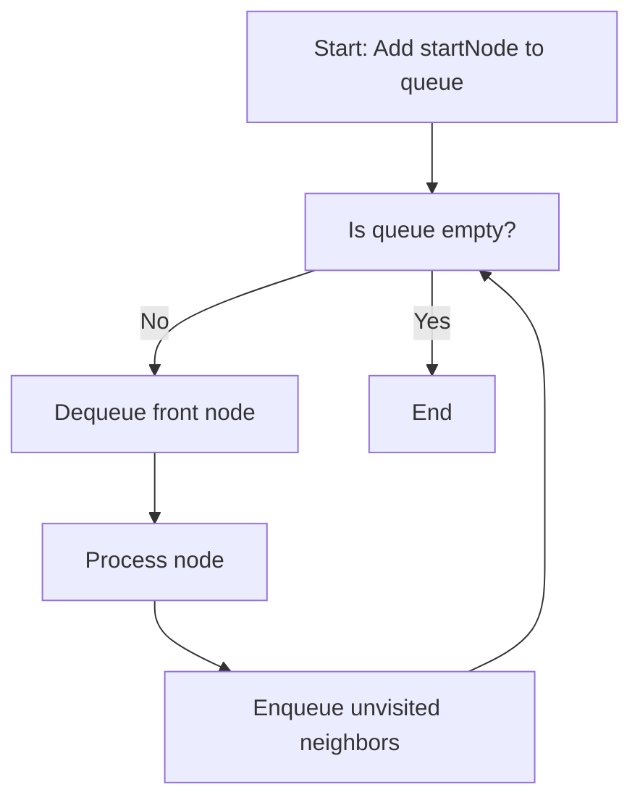
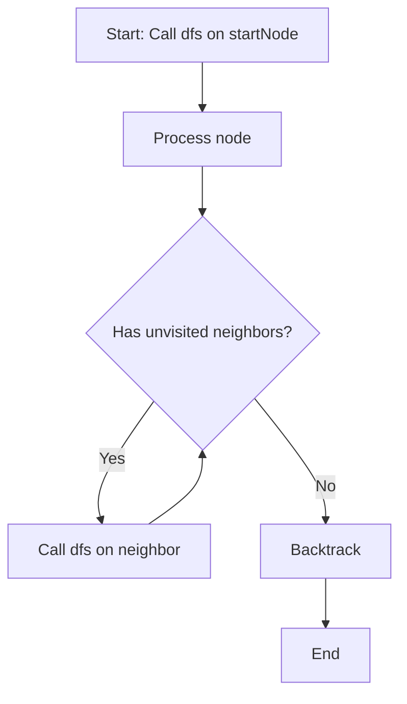
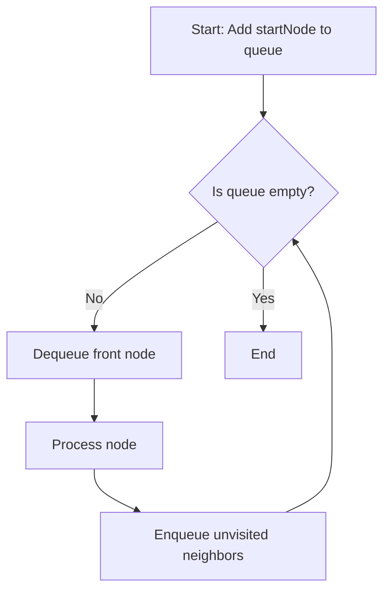

Sure! Here's a summary of the graph traversal concepts using BFS and DFS from the course on Fireship.io:

### Graph Traversal Summary

- **Graph Representation**: Uses adjacency lists to represent graphs, demonstrated with airports and routes.
- **Breadth-First Search (BFS)**: Explores all neighbors level by level using a queue.
- **Depth-First Search (DFS)**: Explores as deep as possible before backtracking, using recursion.

### Code Example

**Breadth-First Search (BFS)**:
```javascript
function bfs(graph, startNode) {
    let queue = [startNode];
    let visited = new Set();
    visited.add(startNode);
    while (queue.length > 0) {
        let node = queue.shift();
        console.log(node);
        for (let neighbor of graph[node]) {
            if (!visited.has(neighbor)) {
                visited.add(neighbor);
                queue.push(neighbor);
            }
        }
    }
}
```

**Depth-First Search (DFS)**:
```javascript
function dfs(graph, startNode, visited = new Set()) {
    visited.add(startNode);
    console.log(startNode);
    for (let neighbor of graph[startNode]) {
        if (!visited.has(neighbor)) {
            dfs(graph, neighbor, visited);
        }
    }
}
```

### Flow Diagrams

#### Breadth-First Search (BFS) Flow Diagram

1. **Initialize Queue**: Start with the initial node in the queue.
2. **Dequeue Node**: Remove the node from the front of the queue.
3. **Process Node**: Visit and process the node.
4. **Enqueue Neighbors**: Add all unvisited neighbors to the queue.
5. **Repeat**: Continue until the queue is empty.

#### Depth-First Search (DFS) Flow Diagram

1. **Initialize Recursion**: Start with the initial node.
2. **Process Node**: Visit and process the node.
3. **Recursive Call**: Recursively visit each unvisited neighbor.
4. **Backtrack**: Once all neighbors are visited, backtrack to the previous node.
5. **Repeat**: Continue until all nodes are visited.

For more detailed content, visit the [Fireship.io course](https://fireship.io/courses/javascript/interview-graphs/).

Sure, here are the flow diagrams for BFS and DFS to help understand the concepts better.

### Breadth-First Search (BFS) Flow Diagram

1. **Initialize Queue**: Start with the initial node in the queue.
2. **Dequeue Node**: Remove the node from the front of the queue.
3. **Process Node**: Visit and process the node.
4. **Enqueue Neighbors**: Add all unvisited neighbors to the queue.
5. **Repeat**: Continue until the queue is empty.

#### BFS Flow Diagram


### Depth-First Search (DFS) Flow Diagram

1. **Initialize Recursion**: Start with the initial node.
2. **Process Node**: Visit and process the node.
3. **Recursive Call**: Recursively visit each unvisited neighbor.
4. **Backtrack**: Once all neighbors are visited, backtrack to the previous node.
5. **Repeat**: Continue until all nodes are visited.

#### DFS Flow Diagram


### Code Examples

**BFS**:
```javascript
function bfs(graph, startNode) {
    let queue = [startNode];
    let visited = new Set();
    visited.add(startNode);
    while (queue.length > 0) {
        let node = queue.shift();
        console.log(node);
        for (let neighbor of graph[node]) {
            if (!visited.has(neighbor)) {
                visited.add(neighbor);
                queue.push(neighbor);
            }
        }
    }
}
```

**DFS**:
```javascript
function dfs(graph, startNode, visited = new Set()) {
    visited.add(startNode);
    console.log(startNode);
    for (let neighbor of graph[startNode]) {
        if (!visited.has(neighbor)) {
            dfs(graph, neighbor, visited);
        }
    }
}
```

These diagrams and code snippets should help in visualizing and understanding how BFS and DFS work.

### Differences Between BFS and DFS

**Breadth-First Search (BFS)**:
1. **Traversal**: Explores nodes level by level.
2. **Data Structure**: Uses a queue.
3. **Memory Usage**: Higher for wide graphs.
4. **Path Finding**: Guarantees shortest path in unweighted graphs.
5. **Implementation**: Iterative using a queue.

**Depth-First Search (DFS)**:
1. **Traversal**: Explores as deep as possible along each branch before backtracking.
2. **Data Structure**: Uses a stack (implicit via recursion or explicit).
3. **Memory Usage**: Higher for deep graphs.
4. **Path Finding**: Does not guarantee shortest path.
5. **Implementation**: Can be recursive or iterative using a stack.

### BFS Flow Diagram



### DFS Flow Diagram


### Code Examples

**BFS**:
```javascript
function bfs(graph, startNode) {
    let queue = [startNode];
    let visited = new Set();
    visited.add(startNode);
    while (queue.length > 0) {
        let node = queue.shift();
        console.log(node);
        for (let neighbor of graph[node]) {
            if (!visited.has(neighbor)) {
                visited.add(neighbor);
                queue.push(neighbor);
            }
        }
    }
}
```

**DFS**:
```javascript
function dfs(graph, startNode, visited = new Set()) {
    visited.add(startNode);
    console.log(startNode);
    for (let neighbor of graph[startNode]) {
        if (!visited.has(neighbor)) {
            dfs(graph, neighbor, visited);
        }
    }
}
```

These differences and visualizations should help clarify when to use BFS or DFS based on the problem at hand.


Certainly! Here's a detailed comparison of BFS and DFS in tabular format along with practical use cases for each:

| Aspect                        | Breadth-First Search (BFS)                                           | Depth-First Search (DFS)                                                |
|-------------------------------|----------------------------------------------------------------------|-------------------------------------------------------------------------|
| **Traversal Method**          | Explores nodes level by level, horizontally                          | Explores as deep as possible along branches before backtracking         |
| **Data Structure Used**       | Queue                                                                | Stack (can be implicit via recursion or explicit)                       |
| **Path Finding**              | Guarantees shortest path in unweighted graphs                        | Does not guarantee the shortest path                                    |
| **Memory Usage**              | Higher for wide graphs (can store all nodes at the current level)    | Higher for deep graphs (can go deep before backtracking)                |
| **Time Complexity**           | O(V + E) where V is vertices and E is edges                          | O(V + E) where V is vertices and E is edges                             |
| **Space Complexity**          | O(V)                                                                 | O(V)                                                                    |
| **Implementation Method**     | Iterative using a queue                                              | Can be recursive or iterative using a stack                             |
| **Applications**              | Shortest path in unweighted graphs, level-order traversal in trees   | Topological sorting, solving puzzles like mazes, pathfinding in deep structures |
| **Practical Use Cases**       |                                                                      |                                                                         |
| **1. Shortest Path**          | Finding the shortest path in an unweighted graph (e.g., social networks) | -                                                                       |
| **2. Pathfinding in Games**   | Finding the shortest path in a grid-based game                        | Exploring all possible moves in a maze or puzzle game                   |
| **3. Web Crawlers**           | Crawling the web to find the shortest path to a resource             | -                                                                       |
| **4. Networking**             | Broadcasting packets in a network                                    | -                                                                       |
| **5. Topological Sorting**    | -                                                                    | Ordering tasks with dependencies (e.g., build systems)                  |
| **6. Cycle Detection**        | -                                                                    | Detecting cycles in a graph                                             |
| **7. Solving Puzzles**        | -                                                                    | Exploring all possible solutions in puzzles (e.g., Sudoku, mazes)       |
| **8. AI Search Algorithms**   | -                                                                    | Depth-limited search, backtracking algorithms                           |

### Practical Use Cases

**BFS Practical Use Cases**:
1. **Shortest Path in Unweighted Graphs**:
   - **Example**: Finding the shortest path in a social network from one user to another.
   ```javascript
   function bfsShortestPath(graph, start, target) {
       let queue = [[start]];
       let visited = new Set();
       visited.add(start);
       while (queue.length > 0) {
           let path = queue.shift();
           let node = path[path.length - 1];
           if (node === target) {
               return path;
           }
           for (let neighbor of graph[node]) {
               if (!visited.has(neighbor)) {
                   visited.add(neighbor);
                   let newPath = path.slice();
                   newPath.push(neighbor);
                   queue.push(newPath);
               }
           }
       }
       return null;
   }
   ```

2. **Web Crawlers**:
   - **Example**: Crawling web pages to find the shortest path to a particular resource.
   - Use BFS to ensure that the closest pages are crawled first.

**DFS Practical Use Cases**:
1. **Topological Sorting**:
   - **Example**: Determining the order of tasks with dependencies.
   ```javascript
   function topologicalSort(graph) {
       let stack = [];
       let visited = new Set();
       for (let node in graph) {
           if (!visited.has(node)) {
               dfsTopologicalSort(node, visited, stack, graph);
           }
       }
       return stack.reverse();
   }

   function dfsTopologicalSort(node, visited, stack, graph) {
       visited.add(node);
       for (let neighbor of graph[node]) {
           if (!visited.has(neighbor)) {
               dfsTopologicalSort(neighbor, visited, stack, graph);
           }
       }
       stack.push(node);
   }
   ```

2. **Solving Puzzles**:
   - **Example**: Exploring all possible solutions in a maze or a Sudoku puzzle.
   - Use DFS to go as deep as possible in the puzzle's solution tree before backtracking.

By understanding these differences and use cases, you can choose the appropriate algorithm for your specific problem.

### Differences Between Recursive and Iterative Implementations in Terms of Complexity

| Aspect                     | Recursive Approach                                                  | Iterative Approach                                                |
|----------------------------|---------------------------------------------------------------------|-------------------------------------------------------------------|
| **Memory Usage**           | Generally higher due to call stack usage (O(depth) space complexity)| Generally lower, uses explicit stack or loop (O(1) or O(n) space) |
| **Time Complexity**        | Similar in both approaches, depends on the algorithm (e.g., O(n))   | Similar in both approaches, depends on the algorithm (e.g., O(n)) |
| **Stack Overflow Risk**    | Higher risk, especially with deep recursion                         | No risk of stack overflow, suitable for large input sizes         |
| **Readability**            | Often more readable and concise for tree/graph traversal            | Sometimes less readable due to explicit stack/loop management     |
| **Ease of Implementation** | Easier for problems with natural recursive structure                | Can be harder to implement, especially with explicit stack        |
| **Debugging**              | Can be harder to debug due to nested function calls                 | Generally easier to debug with linear flow                        |

### Practical Examples

#### Recursive DFS

```javascript
function dfsRecursive(graph, node, visited = new Set()) {
    visited.add(node);
    console.log(node);
    for (let neighbor of graph[node]) {
        if (!visited.has(neighbor)) {
            dfsRecursive(graph, neighbor, visited);
        }
    }
}
```

#### Iterative DFS

```javascript
function dfsIterative(graph, startNode) {
    let stack = [startNode];
    let visited = new Set();
    while (stack.length > 0) {
        let node = stack.pop();
        if (!visited.has(node)) {
            visited.add(node);
            console.log(node);
            for (let neighbor of graph[node]) {
                if (!visited.has(neighbor)) {
                    stack.push(neighbor);
                }
            }
        }
    }
}
```

### Key Takeaways

- **Memory Usage**: Recursive methods can lead to stack overflow with deep recursions, while iterative methods handle larger inputs more gracefully.
- **Readability and Ease**: Recursive solutions are often more concise and easier to read, but iterative methods can be more straightforward to debug and maintain for complex scenarios.