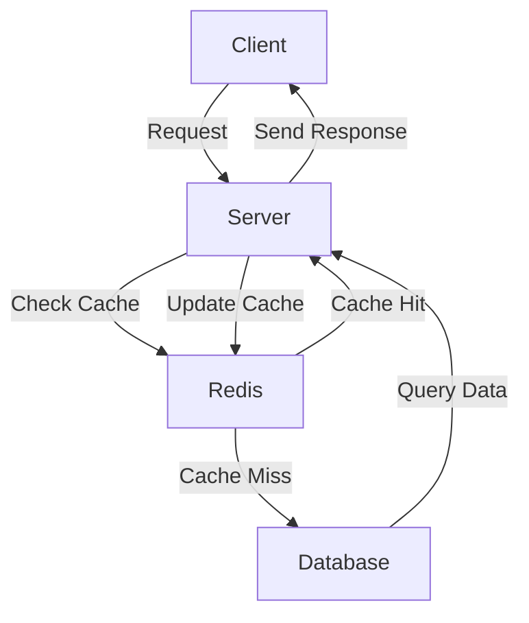

### Database and Caching in Web Development

**Databases**: Used for storing and retrieving data. Common types include SQL (e.g., MySQL, PostgreSQL) and NoSQL (e.g., MongoDB, Redis).

### Example: Database

**SQL Example (MySQL)**:
```sql
-- Create a table
CREATE TABLE users (
    id INT AUTO_INCREMENT PRIMARY KEY,
    name VARCHAR(100)
);

-- Insert a user
INSERT INTO users (name) VALUES ('Alice');

-- Query a user
SELECT * FROM users WHERE id = 1;
```

**Node.js Example with MySQL**:
```javascript
const mysql = require('mysql');
const connection = mysql.createConnection({
  host: 'localhost',
  user: 'root',
  password: '',
  database: 'test'
});

connection.connect();

connection.query('SELECT * FROM users WHERE id = 1', (error, results, fields) => {
  if (error) throw error;
  console.log('User:', results[0]);
});

connection.end();
```

### Example: Caching

**In-Memory Caching with Redis**:
```javascript
const redis = require('redis');
const client = redis.createClient();

client.on('error', (err) => {
  console.log('Redis error:', err);
});

// Set cache
client.set('user:1', JSON.stringify({ id: 1, name: 'Alice' }));

// Get cache
client.get('user:1', (err, reply) => {
  if (err) throw err;
  console.log('User:', JSON.parse(reply));
});
```

### Flow Diagram: Database and Caching



### Explanation

1. **Client Request**: Client sends a request to the server.
2. **Check Cache**: Server checks if the data is in Redis cache.
   - **Cache Hit**: Data is found in cache and returned to client.
   - **Cache Miss**: Data is not in cache; server queries the database.
3. **Database Query**: Server queries the database for the data.
4. **Update Cache**: Data from database is cached in Redis.
5. **Send Response**: Server sends the data back to the client.

### Benefits

- **Performance**: Reduces load on the database by serving frequently accessed data from cache.
- **Scalability**: Improves scalability by handling more requests efficiently.

Using databases for persistent storage and caching for frequently accessed data optimizes web application performance and scalability.