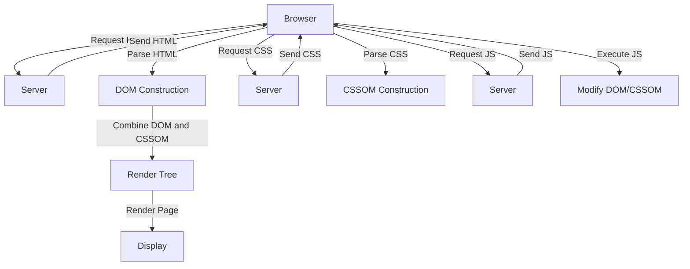

### Complete Cycle of HTML, CSS, and JavaScript Loading

**Overview**:
The process involves loading and rendering web pages, including HTML, CSS, and JavaScript.

### Steps:

1. **HTML Parsing**:
   - **Browser**: Requests the HTML document.
   - **Server**: Sends the HTML file.
   - **Browser**: Parses HTML to construct the DOM (Document Object Model).

2. **CSS Parsing**:
   - **Browser**: Identifies linked or embedded CSS.
   - **Browser**: Requests CSS files.
   - **Server**: Sends CSS files.
   - **Browser**: Parses CSS to construct the CSSOM (CSS Object Model).
   - **Rendering**: Combines DOM and CSSOM into the Render Tree.

3. **JavaScript Execution**:
   - **Browser**: Identifies and requests JavaScript files.
   - **Server**: Sends JavaScript files.
   - **Browser**: Executes JavaScript, which can modify the DOM and CSSOM.

### Flow Diagram:



### Practical Example:

1. **HTML Document**:
   ```html
   <!DOCTYPE html>
   <html lang="en">
   <head>
     <meta charset="UTF-8">
     <meta name="viewport" content="width=device-width, initial-scale=1.0">
     <link rel="stylesheet" href="styles.css">
     <script src="script.js" defer></script>
     <title>Document</title>
   </head>
   <body>
     <h1>Hello, World!</h1>
     <p id="text">This is a paragraph.</p>
   </body>
   </html>
   ```

2. **CSS (styles.css)**:
   ```css
   body {
     font-family: Arial, sans-serif;
     background-color: #f0f0f0;
   }
   h1 {
     color: #333;
   }
   ```

3. **JavaScript (script.js)**:
   ```javascript
   document.addEventListener('DOMContentLoaded', function() {
     document.getElementById('text').textContent = 'JavaScript loaded!';
   });
   ```

### Explanation:

1. **HTML Parsing**: The browser requests and parses the HTML document, constructing the DOM.
2. **CSS Parsing**: The browser requests and parses the CSS, constructing the CSSOM.
3. **JavaScript Execution**: The browser requests and executes JavaScript, which can modify the DOM and CSSOM.
4. **Rendering**: The Render Tree, a combination of the DOM and CSSOM, is used to paint the content to the screen.

This process ensures that web pages are loaded, styled, and interactive, providing a smooth user experience.