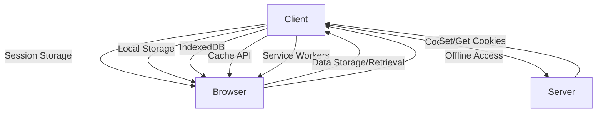
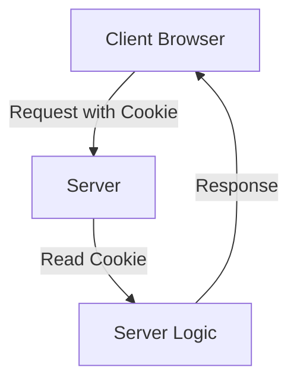

### Web Storage and Caching in Web Development

**1. Session Storage**
   - **Purpose**: Stores data for the duration of the page session.
   - **Example**:
     ```javascript
     // Store data
     sessionStorage.setItem('username', 'JohnDoe');
     // Retrieve data
     const user = sessionStorage.getItem('username');
     console.log(user); // JohnDoe
     ```

**2. Local Storage**
   - **Purpose**: Stores data with no expiration time.
   - **Example**:
     ```javascript
     // Store data
     localStorage.setItem('theme', 'dark');
     // Retrieve data
     const theme = localStorage.getItem('theme');
     console.log(theme); // dark
     ```

**3. Cookies**
   - **Purpose**: Stores data that can be sent to the server with requests.
   - **Example**:
     ```javascript
     // Set a cookie
     document.cookie = "username=JohnDoe; expires=Fri, 31 Dec 2021 23:59:59 GMT";
     // Retrieve a cookie
     const getCookie = (name) => {
       const value = `; ${document.cookie}`;
       const parts = value.split(`; ${name}=`);
       if (parts.length === 2) return parts.pop().split(';').shift();
     };
     console.log(getCookie('username')); // JohnDoe
     ```

**4. IndexedDB**
   - **Purpose**: Client-side storage for structured data.
   - **Example**:
     ```javascript
     // Open database
     const request = indexedDB.open('myDatabase', 1);

     request.onsuccess = (event) => {
       const db = event.target.result;
       // Add data
       const transaction = db.transaction(['users'], 'readwrite');
       const objectStore = transaction.objectStore('users');
       objectStore.add({ id: 1, name: 'JohnDoe' });
     };
     ```

**5. Cache API**
   - **Purpose**: Caching responses for offline access.
   - **Example**:
     ```javascript
     // Open cache
     caches.open('my-cache').then((cache) => {
       // Add to cache
       cache.add('/index.html');
       // Retrieve from cache
       cache.match('/index.html').then((response) => {
         return response.text();
       }).then((text) => {
         console.log(text);
       });
     });
     ```

**6. Service Workers**
   - **Purpose**: Background scripts for handling caching, push notifications, etc.
   - **Example**:
     ```javascript
     // Register service worker
     if ('serviceWorker' in navigator) {
       navigator.serviceWorker.register('/sw.js').then((registration) => {
         console.log('ServiceWorker registration successful with scope: ', registration.scope);
       }, (error) => {
         console.log('ServiceWorker registration failed: ', error);
       });
     }

     // sw.js (Service Worker)
     self.addEventListener('install', (event) => {
       event.waitUntil(
         caches.open('my-cache').then((cache) => {
           return cache.addAll([
             '/',
             '/index.html',
             '/styles.css',
             '/script.js',
           ]);
         })
       );
     });

     self.addEventListener('fetch', (event) => {
       event.respondWith(
         caches.match(event.request).then((response) => {
           return response || fetch(event.request);
         })
       );
     });
     ```

### Flow Diagram



### Summary

- **Session Storage**: Temporary storage during page sessions.
- **Local Storage**: Persistent storage with no expiration.
- **Cookies**: Small data pieces sent with requests.
- **IndexedDB**: Structured data storage.
- **Cache API**: Caching for offline access.
- **Service Workers**: Background scripts for advanced caching and functionality.

### How Cookies are Sent to the Server in ReactJS

**Cookies** are small pieces of data stored on the client side that are sent to the server with every HTTP request. This is often used for session management, authentication, and tracking.

### Practical Example in ReactJS

**1. Setting a Cookie:**

Use a library like `js-cookie` to manage cookies easily.

**Install js-cookie:**
```bash
npm install js-cookie
```

**Set a Cookie:**
```javascript
import Cookies from 'js-cookie';

// Set a cookie
Cookies.set('username', 'JohnDoe', { expires: 7 }); // Expires in 7 days
```

**2. Sending Cookies to the Server:**

Cookies are automatically sent to the server with every HTTP request. You can see this in action by making an API request using `axios`.

**Install axios:**
```bash
npm install axios
```

**Make an API Request:**
```javascript
import axios from 'axios';

axios.get('https://your-api.com/endpoint', { withCredentials: true })
  .then(response => {
    console.log(response.data);
  })
  .catch(error => {
    console.error('Error:', error);
  });
```

**3. Server-Side Handling (Express Example):**

**Server-side code to read the cookie:**
```javascript
const express = require('express');
const cookieParser = require('cookie-parser');

const app = express();
app.use(cookieParser());

app.get('/endpoint', (req, res) => {
  const username = req.cookies.username;
  res.send(`Hello, ${username}`);
});

app.listen(3000, () => {
  console.log('Server is running on port 3000');
});
```

### Flow Diagram



### Explanation

1. **Client sets a cookie**: Using JavaScript (`js-cookie` library), a cookie is set on the client side.
2. **Request with Cookie**: Every HTTP request sent by the client automatically includes the cookie.
3. **Server reads the cookie**: Using middleware like `cookie-parser` in Express, the server reads the cookie from the incoming request.
4. **Server logic**: The server processes the request, possibly using the cookie data.
5. **Response**: The server sends a response back to the client.

This setup ensures that cookies are automatically handled and sent to the server with every request, enabling session management and user tracking in web applications.