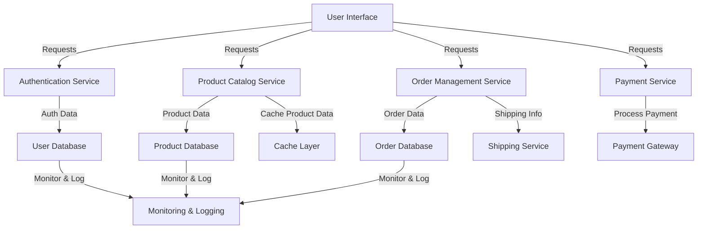

### High-Level Design Example: E-commerce Application

Let's consider a high-level design for an e-commerce application like Amazon.

### Key Components:

1. **User Interface (UI)**:
   - Web application
   - Mobile application

2. **Backend Services**:
   - Authentication Service
   - Product Catalog Service
   - Order Management Service
   - Payment Service

3. **Database**:
   - User Database
   - Product Database
   - Order Database

4. **Caching Layer**:
   - Redis or Memcached

5. **External Services**:
   - Payment Gateway
   - Shipping Service

6. **Monitoring and Logging**:
   - Monitoring: Prometheus, Grafana
   - Logging: ELK Stack (Elasticsearch, Logstash, Kibana)

### Flow Diagram

### Explanation:

1. **User Interface**: Users interact with the application through web or mobile interfaces.
2. **Authentication Service**: Manages user login, registration, and authentication.
3. **Product Catalog Service**: Handles product listing, searching, and viewing.
4. **Order Management Service**: Manages order creation, updates, and tracking.
5. **Payment Service**: Processes payments through external payment gateways.
6. **Database**: Stores user, product, and order information.
7. **Caching Layer**: Caches frequently accessed data to improve performance.
8. **External Services**: Integrates with external services like payment gateways and shipping services.
9. **Monitoring and Logging**: Tracks application performance and logs events for debugging and analysis.

### Practical Scenario

1. **User Browsing**: 
   - A user searches for a product.
   - The request goes to the Product Catalog Service.
   - Product data is fetched from the Product Database or Cache Layer if available.

2. **User Order**:
   - User places an order.
   - Order Management Service processes the order and updates the Order Database.
   - Payment Service handles the payment transaction via the Payment Gateway.
   - Once payment is confirmed, shipping details are sent to the Shipping Service.

3. **Monitoring**:
   - Monitoring tools track the performance and availability of each service.
   - Logs are collected for analysis and troubleshooting.

This high-level design provides a scalable, efficient, and modular structure for an e-commerce application, ensuring smooth operation and easy maintenance.