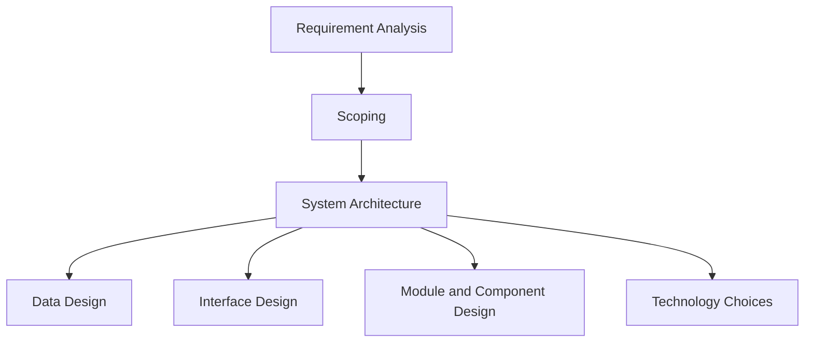

### High-Level Design (HLD) for Frontend Design System

**Objective**:
Develop a modular, scalable, and maintainable frontend architecture that includes all essential components and considerations.

### Key Components

1. **Requirement Analysis**:
   - **Functional Requirements**: Define what the system should do.
   - **Non-Functional Requirements**: Define system performance and reliability.

2. **Scoping**:
   - Identify the scope of the project, including features and functionalities.

3. **System Architecture**:
   - Define the overall architecture, including the main components and their interactions.

4. **Data Design**:
   - Database schema design.
   - Data flow and storage mechanisms.

5. **Interface Design**:
   - Design the user interface and interactions.
   - Mockups and wireframes.

6. **Module and Component Design**:
   - Design individual modules and components.
   - Ensure reusability and scalability.

7. **Technology Choices**:
   - Select appropriate technologies and tools.
   - Example: React, Redux, Axios, Styled Components, Jest.

### Flow Diagram

### Explanation

1. **Requirement Analysis**:
   - Identify functional and non-functional requirements.
   - **Example**: 
     - Functional: User login, product listing.
     - Non-functional: Performance, security, scalability.

2. **Scoping**:
   - Define the scope of the project.
   - **Example**: 
     - Features: Authentication, product catalog, cart.
     - Exclusions: Admin panel, reporting.

3. **System Architecture**:
   - Define the architecture with key components and their interactions.
   - **Example**: 
     - Components: UI, State Management, API Integration.
     - Interactions: Data flow between frontend and backend.

4. **Data Design**:
   - Design the database schema and data flow.
   - **Example**: 
     - User Table: ID, Name, Email.
     - Product Table: ID, Name, Price.

5. **Interface Design**:
   - Create mockups and wireframes for the user interface.
   - **Example**: 
     - Use tools like Figma or Sketch.

6. **Module and Component Design**:
   - Design reusable modules and components.
   - **Example**: 
     - Components: Button, Modal, Form.
     - Modules: Authentication Module, Product Module.

7. **Technology Choices**:
   - Choose the right technologies for the project.
   - **Example**: 
     - Frontend: React, Redux, Axios.
     - Styling: Styled Components.
     - Testing: Jest, Cypress.

### Practical Example: E-commerce Application

1. **Requirement Analysis**:
   - **Functional**: User login, product search, add to cart.
   - **Non-Functional**: Responsive design, fast load times.

2. **Scoping**:
   - **In Scope**: User authentication, product catalog, checkout process.
   - **Out of Scope**: Vendor management, analytics dashboard.

3. **System Architecture**:
   - **Components**: UI Layer, State Management Layer, API Layer.
   - **Interactions**: UI interacts with State Management, which interacts with API Layer.

4. **Data Design**:
   - **User Table**: id, username, password, email.
   - **Product Table**: id, name, description, price, stock.

5. **Interface Design**:
   - **Mockups**: Home page, product page, cart page.

6. **Module and Component Design**:
   - **Components**: Navbar, Footer, Product Card.
   - **Modules**: Auth Module, Product Module.

7. **Technology Choices**:
   - **Frontend**: React, Redux.
   - **Styling**: Styled Components.
   - **API**: Axios.
   - **Testing**: Jest, Cypress.

By incorporating these components into your HLD, you can create a robust, scalable, and maintainable frontend design system.