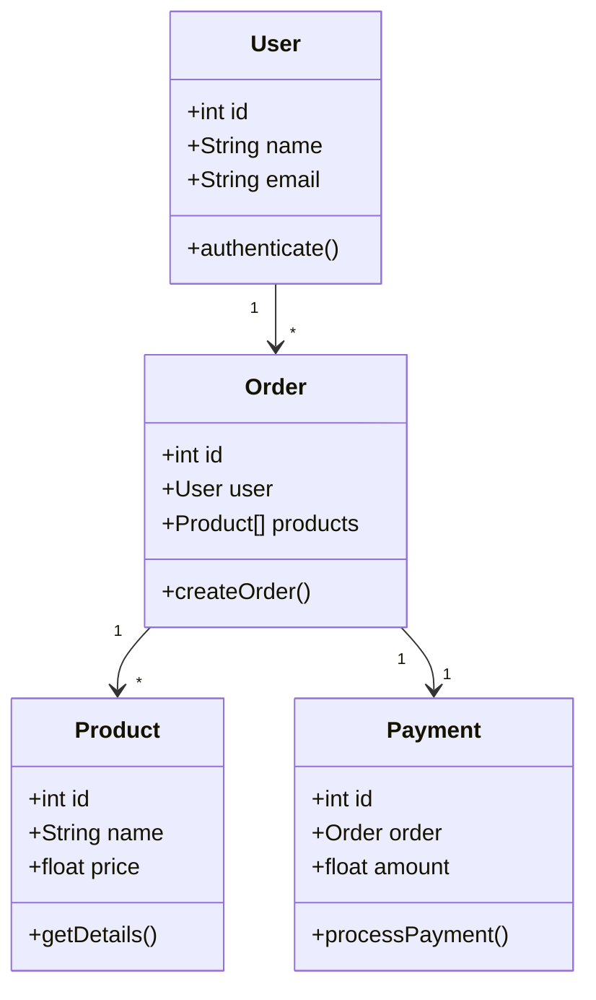
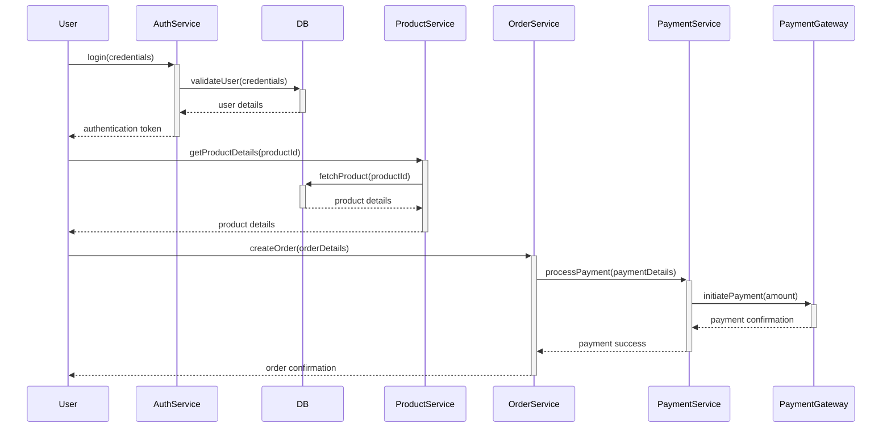
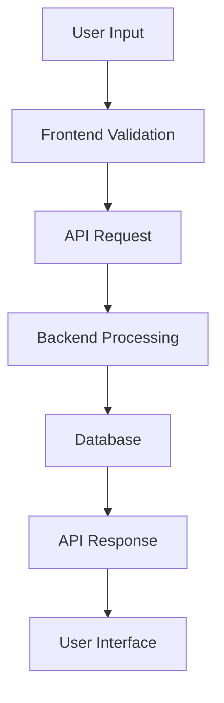
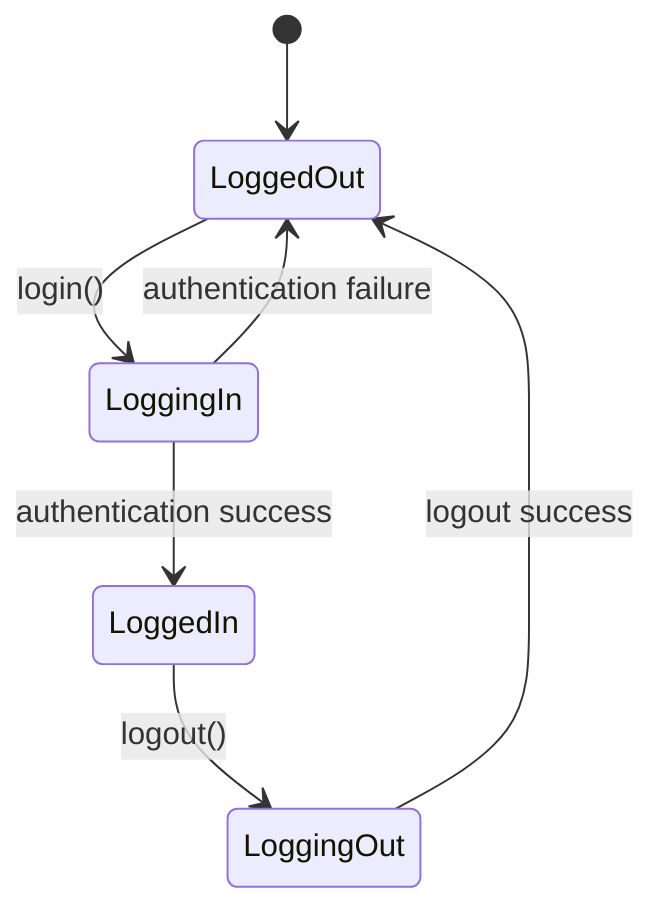
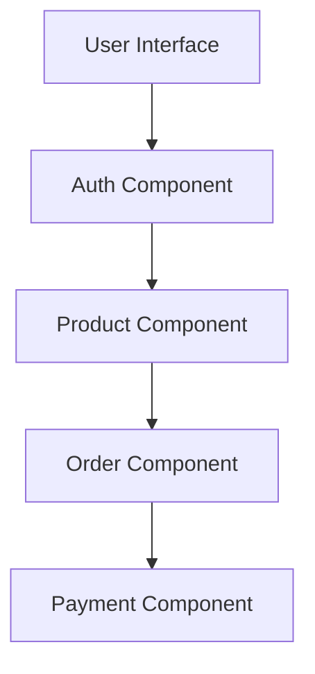

### Low-Level Design (LLD) in Web Development

Low-Level Design (LLD) provides a detailed description of how each component in the high-level design will be implemented. It focuses on the logic, data structures, and algorithms used in the system.

### Key Components of LLD

1. **Class Diagram**:
   - Represents the static structure of the system, showing classes, their attributes, methods, and relationships.
   - **Example**:
     ```mermaid
     classDiagram
     class User {
       +int id
       +String name
       +String email
       +authenticate()
     }
     class Product {
       +int id
       +String name
       +float price
       +getDetails()
     }
     User "1" --> "*" Product
     ```

2. **Sequence Diagram**:
   - Illustrates how objects interact in a particular sequence to perform a function.
   - **Example**:
     ```mermaid
     sequenceDiagram
     User->>+AuthenticationService: login(credentials)
     AuthenticationService->>+Database: validateUser(credentials)
     Database-->>-AuthenticationService: user details
     AuthenticationService-->>-User: authentication token
     ```

3. **Data Flow Diagram (DFD)**:
   - Shows how data moves through the system.
   - **Example**:
     ```mermaid
     graph TD;
       A[User Input] --> B[Frontend Validation]
       B --> C[API Request]
       C --> D[Backend Processing]
       D --> E[Database]
       E --> F[API Response]
       F --> G[User Interface]
     ```

4. **State Diagram**:
   - Describes the states an object can be in and how it transitions from one state to another.
   - **Example**:
     ```mermaid
     stateDiagram
     [*] --> LoggedOut
     LoggedOut --> LoggingIn : login()
     LoggingIn --> LoggedIn : authentication success
     LoggingIn --> LoggedOut : authentication failure
     LoggedIn --> LoggingOut : logout()
     LoggingOut --> LoggedOut : logout success
     ```

5. **Component Diagram**:
   - Details the components and their interactions within the system.
   - **Example**:
     ```mermaid
     graph TD;
       A[User Interface] --> B[Authentication Component]
       B --> C[Product Component]
       C --> D[Order Component]
       D --> E[Payment Component]
     ```

### Practical Example: E-commerce Application

**Class Diagram**:


**Sequence Diagram**:


**Data Flow Diagram**:


**State Diagram**:


**Component Diagram**:


### Summary

- **Class Diagram**: Defines the structure of the system.
- **Sequence Diagram**: Illustrates the flow of operations.
- **Data Flow Diagram**: Shows data movement through the system.
- **State Diagram**: Describes object states and transitions.
- **Component Diagram**: Details system components and their interactions.

These elements provide a detailed view of the system's inner workings, helping developers understand and implement the design.