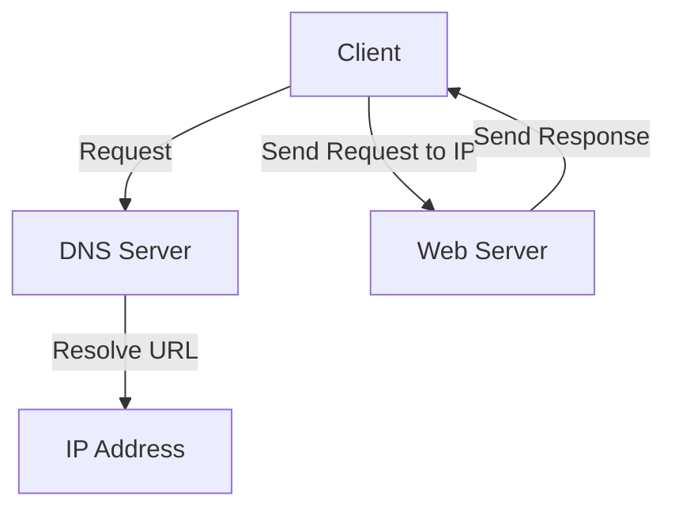

### Communication Protocols

**Concept**: Communication protocols are rules and conventions for data exchange between devices. They ensure that data is transmitted correctly and understood by both sender and receiver.

### Example Protocol: HTTP/HTTPS

**Overview**:
HTTP (HyperText Transfer Protocol) and HTTPS (HTTP Secure) are protocols for transferring hypertext requests and information on the internet.

### Flow Diagram:



### Practical Example:

1. **Client Request**:
   - User enters `https://example.com` in the browser.
   - Browser sends DNS request to resolve the URL to an IP address.

2. **DNS Resolution**:
   - DNS server resolves `example.com` to `192.0.2.1`.

3. **HTTP/HTTPS Request**:
   - Browser sends HTTP/HTTPS GET request to `192.0.2.1`.
   - Example HTTP request:
   - 
     ```http
     GET /index.html HTTP/1.1
     Host: example.com
     ```
     

4. **Server Response**:
   - Web server processes the request and sends back the requested resource.
   - Example HTTP response:
     ```http
     HTTP/1.1 200 OK
     Content-Type: text/html

     <html>
       <head>
         <title>Example</title>
       </head>
       <body>
         <h1>Hello, world!</h1>
       </body>
     </html>
     ```

5. **Rendering**:
   - Browser renders the HTML content, displaying the web page to the user.

### Explanation:

- **DNS Resolution**: Translates human-readable URLs into IP addresses.
- **HTTP/HTTPS Request**: Client sends a request to the server.
- **Server Processing**: Server processes the request and prepares a response.
- **Server Response**: Server sends the requested data back to the client.
- **Rendering**: Browser renders the received data into a user-friendly format.

### Summary:

Communication protocols like HTTP/HTTPS ensure reliable and secure data exchange between clients and servers, enabling seamless web browsing and data transfer.