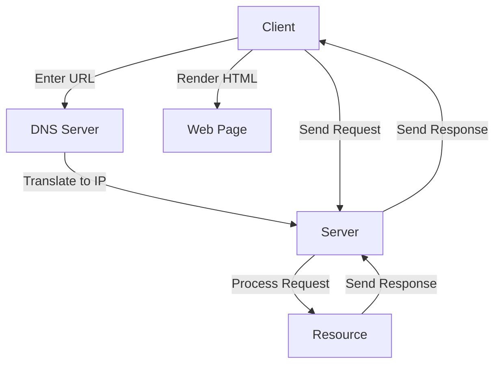

### How the Web Works

**Overview**:
The web operates on a client-server model where users (clients) request resources (web pages, files) from servers.

### Key Components:
1. **Client**: Typically a web browser (e.g., Chrome, Firefox).
2. **Server**: Hosts websites and serves resources.
3. **Internet**: Network connecting clients and servers.

### Process:

1. **DNS Resolution**:
   - **Client**: Enters URL in browser.
   - **DNS Server**: Translates URL to IP address.
   
2. **Request**:
   - **Client**: Sends HTTP/HTTPS request to server.
   - **Example**:
     ```http
     GET /index.html HTTP/1.1
     Host: www.example.com
     ```
   
3. **Server Processing**:
   - **Server**: Receives request, processes it, and fetches the requested resource.
   
4. **Response**:
   - **Server**: Sends HTTP/HTTPS response with requested resource.
   - **Example**:
     ```http
     HTTP/1.1 200 OK
     Content-Type: text/html

     <html>
       <head>
         <title>Example</title>
       </head>
       <body>
         <h1>Hello, world!</h1>
       </body>
     </html>
     ```
   
5. **Rendering**:
   - **Client**: Browser renders HTML, CSS, JavaScript to display the webpage.

### Flow Diagram:
```




```

### Detailed Example:

1. **User enters URL**: `www.example.com`
2. **DNS Lookup**: Resolves `www.example.com` to `192.0.2.1`
3. **Browser sends HTTP GET request**:
   ```http
   GET /index.html HTTP/1.1
   Host: www.example.com
   ```
4. **Server processes request**: Fetches `index.html`
5. **Server responds with HTML**:
   ```http
   HTTP/1.1 200 OK
   Content-Type: text/html

   <html>
     <head>
       <title>Example</title>
     </head>
     <body>
       <h1>Hello, world!</h1>
     </body>
   </html>
   ```
6. **Browser renders webpage**: Displays "Hello, world!"

This simplified flow illustrates how web pages are requested, served, and rendered.