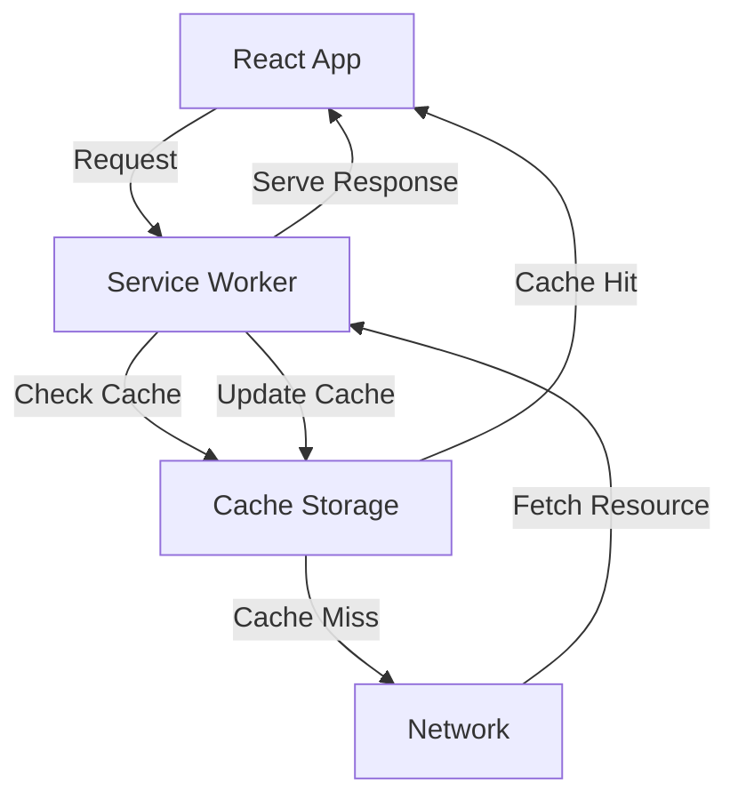

### Offline Support with Service Workers in ReactJS

To provide offline support in a ReactJS application, you can use Service Workers. Service Workers act as a proxy between your web application and the network, enabling caching of assets and API responses, which allows your app to function offline.

### Practical Example: Setting Up Offline Support in ReactJS

**1. Create a React App**:
Use `create-react-app` to set up your project.
```bash
npx create-react-app my-app
cd my-app
```

**2. Register the Service Worker**:
In `src/index.js`, register the service worker.
```javascript
import React from 'react';
import ReactDOM from 'react-dom';
import './index.css';
import App from './App';
import * as serviceWorker from './serviceWorker';

ReactDOM.render(
  <React.StrictMode>
    <App />
  </React.StrictMode>,
  document.getElementById('root')
);

// Register service worker for offline support
serviceWorker.register();
```

**3. Customize the Service Worker**:
Edit the `src/serviceWorker.js` file for custom caching strategies.
```javascript
const CACHE_NAME = 'my-app-cache';
const urlsToCache = [
  '/',
  '/index.html',
  '/static/js/bundle.js',
  // Add other assets to cache
];

self.addEventListener('install', event => {
  event.waitUntil(
    caches.open(CACHE_NAME)
      .then(cache => {
        return cache.addAll(urlsToCache);
      })
  );
});

self.addEventListener('fetch', event => {
  event.respondWith(
    caches.match(event.request)
      .then(response => {
        if (response) {
          return response; // Serve from cache
        }
        return fetch(event.request); // Fetch from network
      })
  );
});
```

**4. Enable Offline Support**:
Ensure the service worker registration is active in `serviceWorker.js`.
```javascript
// This function is to register a service worker
export function register(config) {
  if ('serviceWorker' in navigator) {
    window.addEventListener('load', () => {
      const swUrl = `${process.env.PUBLIC_URL}/service-worker.js`;

      navigator.serviceWorker
        .register(swUrl)
        .then(registration => {
          console.log('Service Worker registered: ', registration);
        })
        .catch(error => {
          console.error('Service Worker registration failed: ', error);
        });
    });
  }
}
```

### Flow Diagram



### Summary

1. **React App**: Requests resources.
2. **Service Worker**: Intercepts requests.
3. **Cache Storage**: Checks if the requested resource is cached.
   - **Cache Hit**: Returns the resource from the cache.
   - **Cache Miss**: Fetches the resource from the network.
4. **Update Cache**: Adds the fetched resource to the cache.
5. **Serve Response**: Returns the resource to the React app.

By implementing these steps, your ReactJS application will be able to work offline, improving user experience during network interruptions.