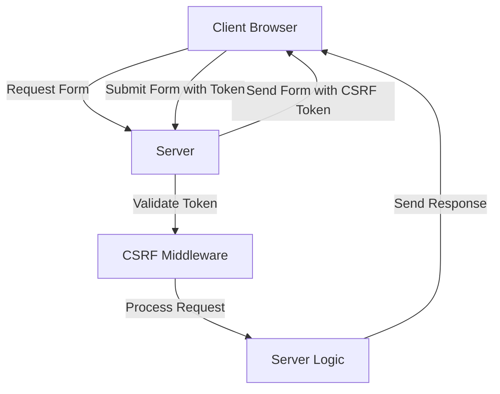

### Cross-Site Requests

**Cross-Site Requests** involve requests initiated from one domain to another. Two common issues are Cross-Site Scripting (XSS) and Cross-Site Request Forgery (CSRF).

**1. Cross-Site Scripting (XSS)**:
- **Description**: An attacker injects malicious scripts into content from a trusted website.
- **Example**: Injecting a script in a comment section that executes when other users view the comment.

**Prevention**:
- Validate and sanitize inputs.
- Use Content Security Policy (CSP).

**2. Cross-Site Request Forgery (CSRF)**:
- **Description**: An attacker tricks a user into executing unwanted actions on a web application where they are authenticated.
- **Example**: A user logged into a banking site clicks a malicious link that transfers money without their knowledge.

**Prevention**:
- Use anti-CSRF tokens.
- Implement SameSite cookies.

### Example: Preventing CSRF in React

**Backend (Node.js with Express)**:
```javascript
const express = require('express');
const csrf = require('csurf');
const cookieParser = require('cookie-parser');

const app = express();
app.use(cookieParser());
app.use(csrf({ cookie: true }));

app.get('/form', (req, res) => {
  res.send(`<form action="/submit" method="POST">
              <input type="hidden" name="_csrf" value="${req.csrfToken()}">
              <button type="submit">Submit</button>
            </form>`);
});

app.post('/submit', (req, res) => {
  res.send('Form submitted successfully');
});

app.listen(3000, () => {
  console.log('Server running on port 3000');
});
```

**Frontend (React)**:
```javascript
import axios from 'axios';

// Fetch CSRF token and make a POST request
axios.get('/form')
  .then(response => {
    const csrfToken = response.data.match(/name="_csrf" value="([^"]+)"/)[1];
    return axios.post('/submit', {}, {
      headers: { 'X-CSRF-Token': csrfToken }
    });
  })
  .then(response => {
    console.log(response.data);
  })
  .catch(error => {
    console.error('Error:', error);
  });
```

### Flow Diagram



### Explanation

1. **Request Form**: Client requests a form from the server.
2. **Send Form with Token**: Server sends the form containing a CSRF token.
3. **Submit Form with Token**: Client submits the form including the CSRF token.
4. **Validate Token**: Server validates the token using CSRF middleware.
5. **Process Request**: Server processes the request if the token is valid.
6. **Send Response**: Server sends a response back to the client.

By implementing these security measures, you can significantly reduce the risk of cross-site vulnerabilities in web applications.