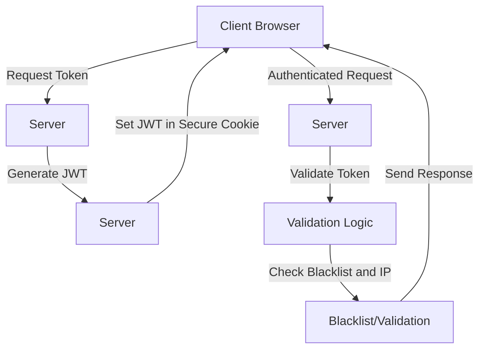
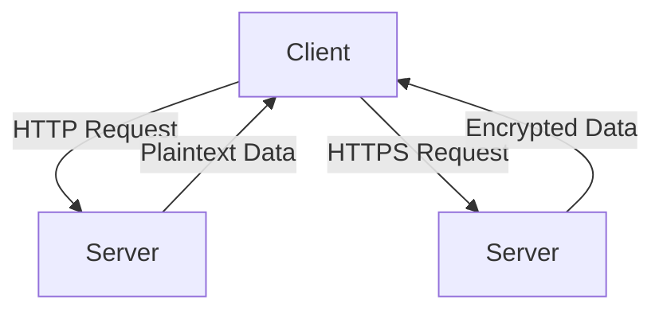

### Scenario: Hacker Retrieves Token from Cookies and Uses It to Hit API

Yes, I understand the scenario. In this case, an attacker manages to steal a JWT from the user's cookies and uses it to make unauthorized API requests.

### Security Measures to Mitigate This Risk

1. **Use HTTPS**:
   - Ensure all communications are over HTTPS to prevent token interception.

2. **HTTP-Only and Secure Cookies**:
   - Mark cookies as `HttpOnly` and `Secure` to prevent access via JavaScript and ensure they are only sent over HTTPS.
   ```javascript
   Cookies.set('token', response.data.token, { httpOnly: true, secure: true, sameSite: 'Strict' });
   ```

3. **Short-Lived Tokens**:
   - Use short expiration times for tokens and implement refresh tokens.
   ```javascript
   const token = jwt.sign({ userId: user.id }, 'secret', { expiresIn: '15m' });
   ```

4. **Token Rotation**:
   - Regularly rotate tokens and use refresh tokens to issue new access tokens.
   ```javascript
   const refreshToken = jwt.sign({ userId: user.id }, 'refreshSecret', { expiresIn: '7d' });
   ```

5. **Token Blacklisting**:
   - Maintain a blacklist to invalidate compromised tokens.
   ```javascript
   const blacklist = new Set();
   blacklist.add(token);
   ```

6. **IP Address and User-Agent Validation**:
   - Check the IP address and user-agent string with each request.
   ```javascript
   const isValidRequest = (req) => {
     const tokenData = jwt.verify(req.token, 'secret');
     return tokenData.ip === req.ip && tokenData.userAgent === req.headers['user-agent'];
   };
   ```

### Flow Diagram: Secure Token Handling



### Summary

1. **Request Token**: Client requests a token from the server.
2. **Generate JWT**: Server generates a JWT and sets it in a secure, HTTP-only cookie.
3. **Authenticated Request**: Client sends an authenticated request with the JWT.
4. **Validate Token**: Server validates the token, checks the blacklist, and verifies IP and user-agent.
5. **Send Response**: Server processes the request and sends a response.

By implementing these measures, you can significantly reduce the risk of token theft and misuse in your web application.


### Differences Between HTTPS and HTTP

**HTTP (HyperText Transfer Protocol)**:
- **No Encryption**: Data sent between the client and server is in plaintext, making it vulnerable to interception.
- **No Authentication**: Does not verify the identity of the server, making it susceptible to man-in-the-middle attacks.
- **Example**: `http://example.com`

**HTTPS (HTTP Secure)**:
- **Encryption**: Uses SSL/TLS to encrypt data, protecting it from interception and tampering.
- **Authentication**: Verifies the server's identity via certificates, ensuring secure communication.
- **Example**: `https://example.com`

### What Happens When Using HTTPS and HTTP

1. **Using HTTPS**:
   - **Secure Communication**: Data is encrypted, preventing eavesdropping.
   - **Integrity**: Ensures data is not tampered with during transmission.
   - **Authentication**: Confirms the server's identity, preventing man-in-the-middle attacks.

2. **Using HTTP**:
   - **Insecure Communication**: Data is sent in plaintext, easily intercepted by attackers.
   - **No Integrity Guarantee**: Data can be modified during transmission.
   - **No Authentication**: No guarantee that the server is legitimate.

### Practical Example

**HTTP Request**:
```plaintext
GET / HTTP/1.1
Host: example.com
```
- Data sent in plaintext.

**HTTPS Request**:
```plaintext
GET / HTTP/1.1
Host: example.com
```
- Data is encrypted and sent securely.

### Flow Diagram



### Summary

- **HTTPS**: Ensures secure, encrypted, and authenticated communication, protecting against data interception and tampering.
- **HTTP**: Sends data in plaintext, making it vulnerable to interception and modification.