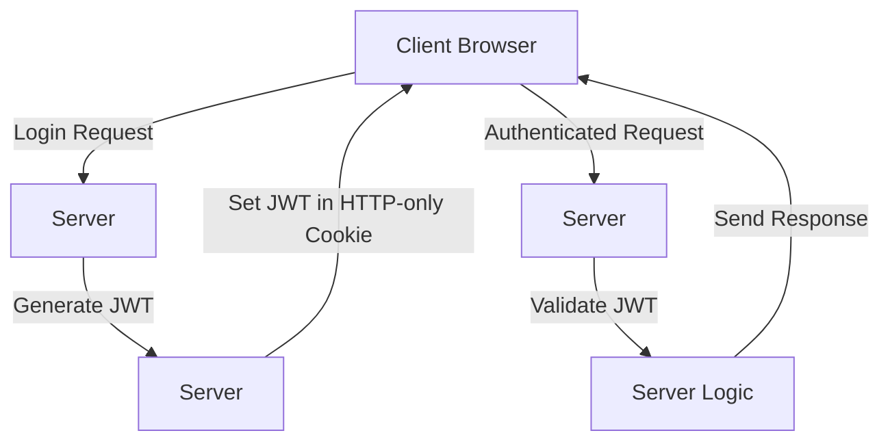

### Securing JWT Tokens in Web Applications

**1. Use HTTPS:**
   - Ensure all communications are over HTTPS to prevent token interception.
   
**2. Store Tokens Securely:**
   - Store JWTs in secure, HTTP-only cookies to prevent XSS attacks.

**3. Use Short-Lived Tokens:**
   - Set short expiration times (`exp` claim) and refresh tokens as needed.

**4. Validate Tokens:**
   - Always validate the token's signature and claims on the server.

**5. Implement Token Blacklisting:**
   - Maintain a blacklist to invalidate compromised tokens.

### Example: Storing and Using JWT in React

**Setting JWT in HTTP-Only Cookie:**
```javascript
import axios from 'axios';
import Cookies from 'js-cookie';

// Set JWT in HTTP-only cookie
axios.post('https://api.example.com/login', { username, password })
  .then(response => {
    Cookies.set('token', response.data.token, { httpOnly: true });
  });
```

**Using JWT from Cookie:**
```javascript
// Retrieve JWT from HTTP-only cookie
const token = Cookies.get('token');

// Make authenticated request
axios.get('https://api.example.com/protected', {
  headers: { Authorization: `Bearer ${token}` }
})
  .then(response => {
    console.log(response.data);
  });
```

### Flow Diagram



### Explanation

1. **Login Request**: Client sends a login request to the server.
2. **Generate JWT**: Server generates a JWT upon successful authentication.
3. **Set JWT in Cookie**: JWT is stored in an HTTP-only cookie on the client.
4. **Authenticated Request**: Client includes JWT in the Authorization header for subsequent requests.
5. **Validate JWT**: Server validates the token's signature and claims.
6. **Response**: Server processes the request and sends a response.

This setup helps ensure the security and integrity of JWT tokens in web applications.


### Securing JWT Tokens in Web Applications

**1. Use HTTPS:**
   - Ensure all communications are over HTTPS to prevent token interception.

**2. Store Tokens Securely:**
   - Store JWTs in secure, HTTP-only cookies to prevent XSS attacks.

**3. Use Short-Lived Tokens:**
   - Set short expiration times (`exp` claim) and refresh tokens as needed.

**4. Validate Tokens:**
   - Always validate the token's signature and claims on the server.

**5. Implement Token Blacklisting:**
   - Maintain a blacklist to invalidate compromised tokens.

### Example: Storing and Using JWT in React

**Setting JWT in HTTP-Only Cookie:**
```javascript
import axios from 'axios';
import Cookies from 'js-cookie';

// Set JWT in HTTP-only cookie
axios.post('https://api.example.com/login', { username, password })
  .then(response => {
    Cookies.set('token', response.data.token, { secure: true, sameSite: 'Strict' });
  });
```

**Using JWT from Cookie:**
```javascript
// Retrieve JWT from cookie
const token = Cookies.get('token');

// Make authenticated request
axios.get('https://api.example.com/protected', {
  headers: { Authorization: `Bearer ${token}` }
})
  .then(response => {
    console.log(response.data);
  });
```

### Flow Diagram


### Explanation

1. **Login Request**: Client sends a login request to the server.
2. **Generate JWT**: Server generates a JWT upon successful authentication.
3. **Set JWT in Cookie**: JWT is stored in an HTTP-only cookie on the client.
4. **Authenticated Request**: Client includes JWT in the Authorization header for subsequent requests.
5. **Validate JWT**: Server validates the token's signature and claims.
6. **Response**: Server processes the request and sends a response.

### Security Measures

1. **HTTP-Only Cookies**: 
   - Prevents JavaScript access to the cookie, mitigating XSS attacks.

2. **Secure Cookie Flag**:
   - Ensures the cookie is sent only over HTTPS, preventing Man-In-The-Middle attacks.

3. **SameSite Attribute**:
   - Mitigates CSRF attacks by controlling whether the cookie is sent with cross-site requests.

4. **Short-Lived Tokens**:
   - Limits the duration a stolen token is valid.

5. **Token Rotation**:
   - Regularly rotates tokens and uses refresh tokens to mitigate the impact of a compromised token.

### Conclusion

Using HTTP-only, secure, and SameSite cookies helps protect JWT tokens from common web vulnerabilities. While no method is foolproof, combining these techniques significantly enhances security.