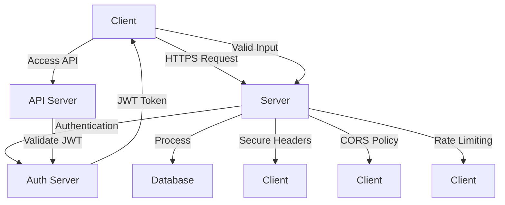

### Security Techniques in Web Development

**1. HTTPS (SSL/TLS)**:
   - **Concept**: Secure communication over HTTP.
   - **Example**: Encrypts data between client and server.
   - **Flow Diagram**:
     ```mermaid
     graph TD;
       A[Client] -->|Request HTTPS| B[Server]
       B -->|SSL/TLS Handshake| A
       A -->|Encrypted Communication| B
     ```

**2. Authentication and Authorization**:
   - **Concept**: Ensure users are who they say they are and have access rights.
   - **Example**: JWT (JSON Web Tokens) for authentication.
   - **Flow Diagram**:
     ```mermaid
     graph TD;
       A[Client] -->|Login Request| B[Server]
       B -->|Validate Credentials| C[Database]
       C -->|Return JWT| B
       B -->|Send JWT| A
       A -->|Access Protected Route| D[Protected Resource]
       D -->|Validate JWT| A
     ```

**3. Input Validation and Sanitization**:
   - **Concept**: Prevent malicious input.
   - **Example**: Sanitize inputs to prevent SQL injection and XSS.
   - **Code**:
     ```javascript
     const sanitizeInput = (input) => input.replace(/[<>'"]/g, '');
     ```

**4. Content Security Policy (CSP)**:
   - **Concept**: Prevent XSS by specifying allowed sources of content.
   - **Example**:
   - 
     ```http
     Content-Security-Policy: default-src 'self'; img-src https://*; child-src 'none';
     ```
     

**5. Secure Headers**:
   - **Concept**: Enhance security with HTTP headers.
   - **Example**: Use headers like `Strict-Transport-Security`, `X-Content-Type-Options`.
   - **Code**:
     ```javascript
     app.use(helmet());
     ```

**6. Cross-Origin Resource Sharing (CORS)**:
   - **Concept**: Control cross-origin requests.
   - **Example**: Set up CORS policy to allow specific origins.
   - **Code**:
     ```javascript
     const cors = require('cors');
     app.use(cors({ origin: 'https://example.com' }));
     ```

**7. Rate Limiting**:
   - **Concept**: Prevent brute force attacks.
   - **Example**: Limit number of requests per IP.
   - **Code**:
     ```javascript
     const rateLimit = require('express-rate-limit');
     const limiter = rateLimit({ windowMs: 15 * 60 * 1000, max: 100 });
     app.use(limiter);
     ```

**8. Secure React App**:
   - **Concept**: Secure React frontend.
   - **Example**: Use environment variables for sensitive data.
   - **Code**:
     ```javascript
     // .env file
     REACT_APP_API_URL=https://api.example.com
     ```

### Flow Diagram: Secure Web Application



## Flow Diagram: Secure Web Application

### Summary
By implementing these security techniques, you can significantly enhance the security of your web applications, protecting them from various threats and vulnerabilities.