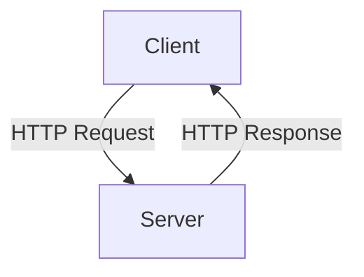
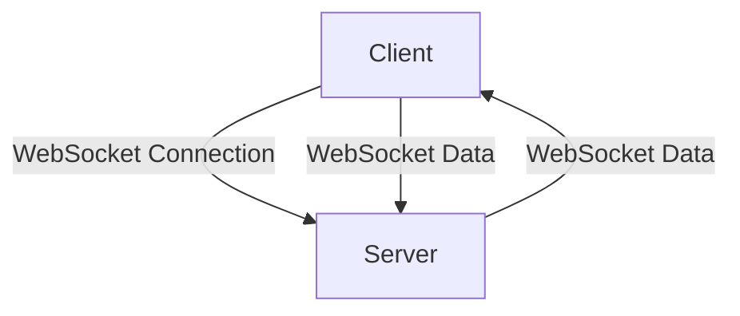
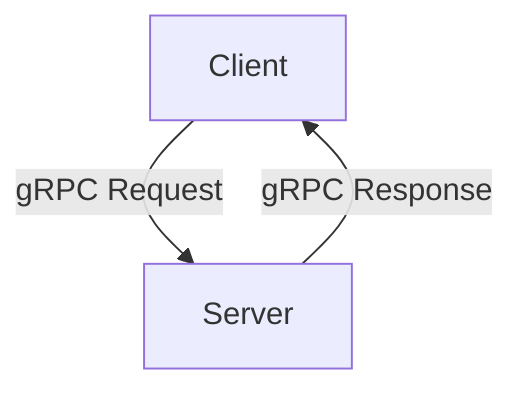
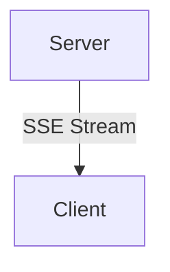
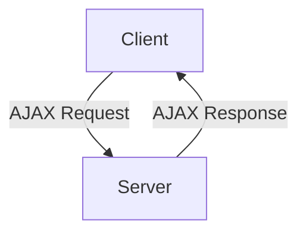
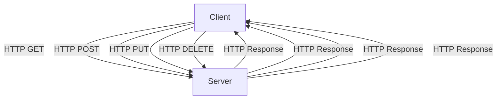
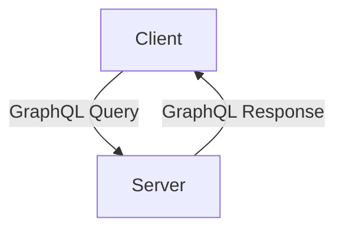

Web development involves various communication techniques for different purposes. Here are some key techniques along with practical examples and flow diagrams:

### 1. HTTP/HTTPS
**Use Case**: Standard web communication for browsers and servers.
**Example**: REST API

#### Flow Diagram:


#### Example Code (Node.js with Express):
```javascript
const express = require('express');
const app = express();

app.get('/api/data', (req, res) => {
  res.json({ message: 'Hello, World!' });
});

app.listen(3000, () => console.log('Server running on port 3000'));
```

### 2. WebSockets
**Use Case**: Real-time communication.
**Example**: Chat applications.

#### Flow Diagram:


#### Example Code (Node.js with ws):
```javascript
const WebSocket = require('ws');
const wss = new WebSocket.Server({ port: 8080 });

wss.on('connection', ws => {
  ws.on('message', message => {
    console.log('received:', message);
    ws.send('Hello, Client!');
  });
});
```

### 3. gRPC
**Use Case**: High-performance, language-agnostic RPC.
**Example**: Microservices communication.

#### Flow Diagram:


#### Example Code (gRPC with Node.js):
```javascript
const grpc = require('@grpc/grpc-js');
const protoLoader = require('@grpc/proto-loader');

const packageDefinition = protoLoader.loadSync('service.proto');
const service = grpc.loadPackageDefinition(packageDefinition).service;

const server = new grpc.Server();
server.addService(service.Service.service, {
  sayHello: (call, callback) => {
    callback(null, { message: 'Hello ' + call.request.name });
  },
});
server.bindAsync('0.0.0.0:50051', grpc.ServerCredentials.createInsecure(), () => {
  server.start();
});
```

### 4. Server-Sent Events (SSE)
**Use Case**: Unidirectional real-time updates from server to client.
**Example**: Live score updates.

#### Flow Diagram:


#### Example Code (Node.js with Express):
```javascript
const express = require('express');
const app = express();

app.get('/events', (req, res) => {
  res.setHeader('Content-Type', 'text/event-stream');
  res.setHeader('Cache-Control', 'no-cache');
  res.setHeader('Connection', 'keep-alive');
  res.flushHeaders();

  setInterval(() => {
    res.write(`data: ${new Date().toISOString()}\n\n`);
  }, 1000);
});

app.listen(3000, () => console.log('Server running on port 3000'));
```

### 5. AJAX (Asynchronous JavaScript and XML)
**Use Case**: Asynchronous web requests.
**Example**: Fetch data without reloading the page.

#### Flow Diagram:


#### Example Code (Client-side JavaScript):
```javascript
fetch('/api/data')
  .then(response => response.json())
  .then(data => console.log(data));
```

### 6. REST (Representational State Transfer)
**Use Case**: Standard for designing networked applications.
**Example**: CRUD operations.

#### Flow Diagram:


#### Example Code (Node.js with Express):
```javascript
const express = require('express');
const app = express();
app.use(express.json());

let data = [];

app.get('/api/items', (req, res) => res.json(data));
app.post('/api/items', (req, res) => {
  const item = req.body;
  data.push(item);
  res.status(201).json(item);
});
app.put('/api/items/:id', (req, res) => {
  const id = req.params.id;
  const updatedItem = req.body;
  data = data.map(item => (item.id === id ? updatedItem : item));
  res.json(updatedItem);
});
app.delete('/api/items/:id', (req, res) => {
  const id = req.params.id;
  data = data.filter(item => item.id !== id);
  res.status(204).end();
});

app.listen(3000, () => console.log('Server running on port 3000'));
```

### 7. GraphQL
**Use Case**: Query language for APIs, allows clients to request specific data.
**Example**: Fetching related data in a single request.

#### Flow Diagram:


#### Example Code (Node.js with Apollo Server):
```javascript
const { ApolloServer, gql } = require('apollo-server');

const typeDefs = gql`
  type Query {
    hello: String
  }
`;

const resolvers = {
  Query: {
    hello: () => 'Hello, world!',
  },
};

const server = new ApolloServer({ typeDefs, resolvers });

server.listen().then(({ url }) => {
  console.log(`Server ready at ${url}`);
});
```

By understanding these different communication techniques and how to implement them, you can choose the right method for your specific web development needs.

### Long Polling, Short Polling, and Webhooks

### Long Polling
**Use Case**: Simulate real-time communication.
- **Description**: The client makes a request to the server and keeps the connection open until new data is available. Once data is received, the client immediately makes another request.
- **Flow Diagram**:
  ```mermaid
  flowchart TD
      A[Client] -->|Request| B[Server]
      B -->|Wait for Data| A
      A -->|Receive Data| B
      B -->|New Request| A
  ```

**Example** (Node.js):
```javascript
app.get('/poll', (req, res) => {
  // Simulate a delay
  setTimeout(() => {
    res.json({ message: 'New data available' });
  }, 10000); // 10 seconds delay
});
```

### Short Polling
**Use Case**: Regularly check for updates.
- **Description**: The client repeatedly makes requests at regular intervals to check for new data.
- **Flow Diagram**:
  ```mermaid
  flowchart TD
      A[Client] -->|Request| B[Server]
      B -->|Send Response| A
      A -->|Wait Interval| A
      A -->|New Request| B
  ```

**Example** (Node.js):
```javascript
app.get('/poll', (req, res) => {
  res.json({ message: 'Check for updates' });
});
```

### Webhooks
**Use Case**: Real-time updates via callbacks.
- **Description**: The server sends data to a client-provided URL when an event occurs. The client doesn't need to poll the server.
- **Flow Diagram**:
  ```mermaid
  flowchart TD
      A[Server] -->|Event Occurs| B[Client URL]
      B -->|Acknowledge| A
  ```

**Example** (Express.js):
```javascript
app.post('/webhook', (req, res) => {
  const data = req.body;
  console.log('Webhook received:', data);
  res.status(200).send('OK');
});
```

### Choosing the Right Technique
- **Long Polling**: Use for real-time updates when WebSockets or SSE are not feasible.
- **Short Polling**: Use for simpler implementations with acceptable delays.
- **Webhooks**: Use for efficient, event-driven communication without client-side polling.

Certainly! Here is a description and coding examples for different communication techniques used in web development, along with practical use cases:

### 1. HTTP/HTTPS
**Use Case**: Standard web communication for fetching data from servers, commonly used in REST APIs.

**Description**: HTTP (Hypertext Transfer Protocol) and HTTPS (HTTP Secure) are protocols for fetching resources, such as HTML documents. HTTPS adds a layer of encryption for security.

#### Server-Side Example (Node.js with Express):
```javascript
const express = require('express');
const app = express();

app.get('/api/data', (req, res) => {
  res.json({ message: 'Hello, World!' });
});

app.listen(3000, () => console.log('Server running on port 3000'));
```

#### Client-Side Example (JavaScript):
```javascript
fetch('/api/data')
  .then(response => response.json())
  .then(data => console.log(data))
  .catch(error => console.error('Error:', error));
```

### 2. WebSockets
**Use Case**: Real-time communication, such as chat applications and live notifications.

**Description**: WebSockets provide a full-duplex communication channel over a single, long-lived connection, allowing for real-time data exchange between client and server.

#### Server-Side Example (Node.js with ws):
```javascript
const WebSocket = require('ws');
const wss = new WebSocket.Server({ port: 8080 });

wss.on('connection', ws => {
  ws.on('message', message => {
    console.log('received:', message);
    ws.send('Hello, Client!');
  });
});
```

#### Client-Side Example (JavaScript):
```javascript
const socket = new WebSocket('ws://localhost:8080');

socket.onopen = () => {
  console.log('Connected');
  socket.send('Hello, Server!');
};

socket.onmessage = (event) => {
  console.log('Message from server:', event.data);
};
```

### 3. gRPC
**Use Case**: High-performance, language-agnostic RPC (Remote Procedure Call), useful for microservices communication.

**Description**: gRPC uses HTTP/2 for transport, Protocol Buffers as the interface description language, and supports multiple programming languages.

#### Server-Side Example (Node.js with gRPC):
```javascript
const grpc = require('@grpc/grpc-js');
const protoLoader = require('@grpc/proto-loader');

const packageDefinition = protoLoader.loadSync('service.proto', {});
const serviceProto = grpc.loadPackageDefinition(packageDefinition).service;

const server = new grpc.Server();
server.addService(serviceProto.Service.service, {
  sayHello: (call, callback) => {
    callback(null, { message: 'Hello ' + call.request.name });
  },
});
server.bindAsync('0.0.0.0:50051', grpc.ServerCredentials.createInsecure(), () => {
  server.start();
});
```

#### Client-Side Example (Node.js with gRPC):
```javascript
const grpc = require('@grpc/grpc-js');
const protoLoader = require('@grpc/proto-loader');

const packageDefinition = protoLoader.loadSync('service.proto', {});
const serviceProto = grpc.loadPackageDefinition(packageDefinition).service;

const client = new serviceProto.Service('localhost:50051', grpc.credentials.createInsecure());

client.sayHello({ name: 'World' }, (error, response) => {
  if (!error) {
    console.log('Greeting:', response.message);
  } else {
    console.error('Error:', error);
  }
});
```

### 4. Server-Sent Events (SSE)
**Use Case**: Unidirectional real-time updates from server to client, such as live score updates.

**Description**: SSE allows servers to push updates to clients over a single, long-lived HTTP connection.

#### Server-Side Example (Node.js with Express):
```javascript
const express = require('express');
const app = express();

app.get('/events', (req, res) => {
  res.setHeader('Content-Type', 'text/event-stream');
  res.setHeader('Cache-Control', 'no-cache');
  res.setHeader('Connection', 'keep-alive');
  res.flushHeaders();

  setInterval(() => {
    res.write(`data: ${new Date().toISOString()}\n\n`);
  }, 1000);
});

app.listen(3000, () => console.log('Server running on port 3000'));
```

#### Client-Side Example (JavaScript):
```javascript
const eventSource = new EventSource('/events');

eventSource.onmessage = (event) => {
  console.log('New message from server:', event.data);
};
```

### 5. AJAX (Asynchronous JavaScript and XML)
**Use Case**: Fetching data from the server without reloading the page, commonly used for dynamic web pages.

**Description**: AJAX allows web pages to be updated asynchronously by exchanging small amounts of data with the server behind the scenes.

#### Server-Side Example (Node.js with Express):
```javascript
const express = require('express');
const app = express();

app.get('/api/data', (req, res) => {
  res.json({ message: 'Hello, World!' });
});

app.listen(3000, () => console.log('Server running on port 3000'));
```

#### Client-Side Example (JavaScript):
```javascript
fetch('/api/data')
  .then(response => response.json())
  .then(data => console.log(data))
  .catch(error => console.error('Error:', error));
```

### 6. REST (Representational State Transfer)
**Use Case**: Standard for designing networked applications, such as CRUD operations.

**Description**: RESTful APIs use HTTP requests to perform CRUD operations (Create, Read, Update, Delete).

#### Server-Side Example (Node.js with Express):
```javascript
const express = require('express');
const app = express();
app.use(express.json());

let data = [];

app.get('/api/items', (req, res) => res.json(data));
app.post('/api/items', (req, res) => {
  const item = req.body;
  data.push(item);
  res.status(201).json(item);
});
app.put('/api/items/:id', (req, res) => {
  const id = req.params.id;
  const updatedItem = req.body;
  data = data.map(item => (item.id === id ? updatedItem : item));
  res.json(updatedItem);
});
app.delete('/api/items/:id', (req, res) => {
  const id = req.params.id;
  data = data.filter(item => item.id !== id);
  res.status(204).end();
});

app.listen(3000, () => console.log('Server running on port 3000'));
```

#### Client-Side Example (JavaScript):
```javascript
fetch('/api/items')
  .then(response => response.json())
  .then(data => console.log(data))
  .catch(error => console.error('Error:', error));
```

### 7. GraphQL
**Use Case**: Query language for APIs, allowing clients to request specific data.

**Description**: GraphQL allows clients to request exactly the data they need, making it more efficient than REST in certain scenarios.

#### Server-Side Example (Node.js with Apollo Server):
```javascript
const { ApolloServer, gql } = require('apollo-server');

const typeDefs = gql`
  type Query {
    hello: String
  }
`;

const resolvers = {
  Query: {
    hello: () => 'Hello, world!',
  },
};

const server = new ApolloServer({ typeDefs, resolvers });

server.listen().then(({ url }) => {
  console.log(`Server ready at ${url}`);
});
```

#### Client-Side Example (JavaScript with Apollo Client):
```javascript
import { ApolloClient, InMemoryCache, gql } from '@apollo/client';

const client = new ApolloClient({
  uri: 'http://localhost:4000',
  cache: new InMemoryCache(),
});

client
  .query({
    query: gql`
      query GetGreeting {
        hello
      }
    `,
  })
  .then(result => console.log(result.data.hello));
```

### 8. Webhooks
**Use Case**: Real-time updates via callbacks, useful for event-driven architectures.

**Description**: Webhooks allow servers to send real-time data to a client-provided URL when certain events occur.

#### Server-Side Example (Node.js with Express):
```javascript
const express = require('express');
const bodyParser = require('body-parser');
const app = express();
const port = 3000;

app.use(bodyParser.json());

app.post('/webhook', (req, res) => {
  const data = req.body;
  console.log('Webhook received:', data);
  res.status(200).send('OK');
});

app.listen(port, () => console.log(`Server running on port ${port}`));
```

#### Client-Side Simulation (JavaScript):
```javascript
function sendWebhook() {
  fetch('/webhook', {
    method: 'POST',
    headers: {
      'Content-Type': 'application/json'
    },
    body: JSON.stringify({ message: 'Hello, webhook!' })
  })
  .then(response => response.text())
  .then(data => console.log(data))
  .catch(error => console.error('Error:', error));
}

// Simulate sending a webhook
sendWebhook();
```

These examples demonstrate various communication techniques in web development, highlighting their use cases and providing both server-side and client-side code to illustrate their implementation.

### Long Polling

**Server-side (Node.js with Express)**:
```javascript
const express = require('express');
const app = express();
const port = 3000;

app.get('/poll', (req, res) => {
  setTimeout(() => {
    res.json({ message: 'New data available' });
  }, 10000); // 10 seconds delay
});

app.listen(port, () => console.log(`Server running on port ${port}`));
```

**Client-side (JavaScript)**:
```javascript
function longPoll() {
  fetch('/poll')
    .then(response => response.json())
    .then(data => {
      console.log(data.message);
      longPoll(); // Recursively call to keep polling
    })
    .catch(error => console.error('Error:', error));
}

longPoll();
```

### Short Polling

**Server-side (Node.js with Express)**:
```javascript
const express = require('express');
const app = express();
const port = 3000;

app.get('/poll', (req, res) => {
  res.json({ message: 'Check for updates' });
});

app.listen(port, () => console.log(`Server running on port ${port}`));
```

**Client-side (JavaScript)**:
```javascript
function shortPoll() {
  fetch('/poll')
    .then(response => response.json())
    .then(data => console.log(data.message))
    .catch(error => console.error('Error:', error));
}

setInterval(shortPoll, 5000); // Poll every 5 seconds
```

### Webhooks

**Server-side (Node.js with Express)**:
```javascript
const express = require('express');
const bodyParser = require('body-parser');
const app = express();
const port = 3000;

app.use(bodyParser.json());

app.post('/webhook', (req, res) => {
  const data = req.body;
  console.log('Webhook received:', data);
  res.status(200).send('OK');
});

app.listen(port, () => console.log(`Server running on port ${port}`));
```

**Client-side Simulation (JavaScript)**:
```javascript
function sendWebhook() {
  fetch('/webhook', {
    method: 'POST',
    headers: {
      'Content-Type': 'application/json'
    },
    body: JSON.stringify({ message: 'Hello, webhook!' })
  })
  .then(response => response.text())
  .then(data => console.log(data))
  .catch(error => console.error('Error:', error));
}

// Simulate sending a webhook
sendWebhook();
```

### Explanations

1. **Long Polling**:
   - The client sends a request to the server and waits for a response.
   - The server holds the request open until it has new data or a timeout occurs.
   - Once data is sent, the client immediately sends a new request to maintain the connection.

2. **Short Polling**:
   - The client sends requests to the server at regular intervals to check for new data.
   - The server responds immediately to each request, whether it has new data or not.

3. **Webhooks**:
   - The server sends data to a client-specified URL when certain events occur.
   - The client sets up a URL to receive the webhook data and processes it accordingly.

These examples demonstrate the basic implementation and usage of each communication technique. Adjust the intervals and handling logic as needed for your specific use case.