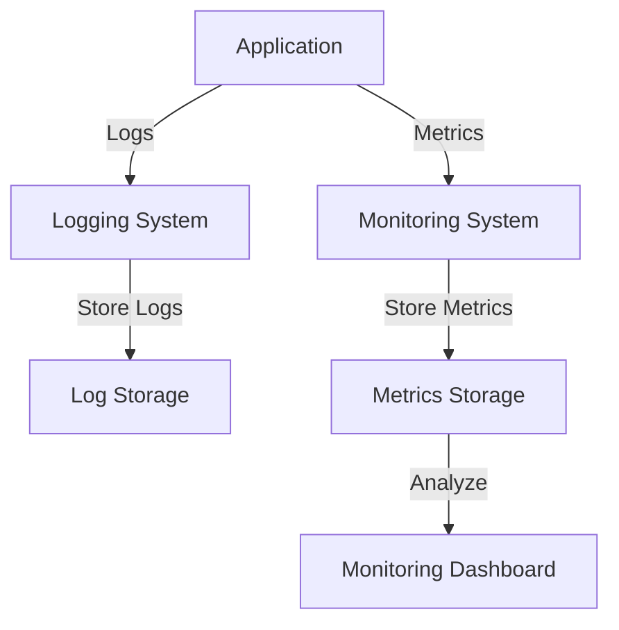

### Logging and Monitoring in Web Development

**Logging**:
- **Purpose**: Track and record application events for debugging and auditing.
- **Tools**: Winston, Morgan (Node.js), Log4js.
- **Example**:
  ```javascript
  const winston = require('winston');

  const logger = winston.createLogger({
    level: 'info',
    format: winston.format.json(),
    transports: [
      new winston.transports.File({ filename: 'error.log', level: 'error' }),
      new winston.transports.File({ filename: 'combined.log' })
    ]
  });

  logger.info('This is an info message');
  logger.error('This is an error message');
  ```

**Monitoring**:
- **Purpose**: Continuously check the health and performance of applications.
- **Tools**: Prometheus, Grafana, New Relic.
- **Example**:
  ```javascript
  const express = require('express');
  const app = express();
  const client = require('prom-client');

  const collectDefaultMetrics = client.collectDefaultMetrics;
  collectDefaultMetrics();

  app.get('/', (req, res) => {
    res.send('Hello World');
  });

  app.get('/metrics', (req, res) => {
    res.set('Content-Type', client.register.contentType);
    res.end(client.register.metrics());
  });

  app.listen(3000, () => {
    console.log('Server is running on port 3000');
  });
  ```

### Flow Diagram



### Explanation

1. **Application**: Generates logs and metrics.
2. **Logging System**: Collects and stores logs.
3. **Monitoring System**: Collects and stores metrics.
4. **Log Storage**: Stores logs for later analysis.
5. **Metrics Storage**: Stores metrics for monitoring.
6. **Monitoring Dashboard**: Displays metrics for real-time analysis.

### Summary

- **Logging**: Captures and stores application events.
- **Monitoring**: Tracks application performance and health.
- **Tools**: Use tools like Winston for logging and Prometheus/Grafana for monitoring.